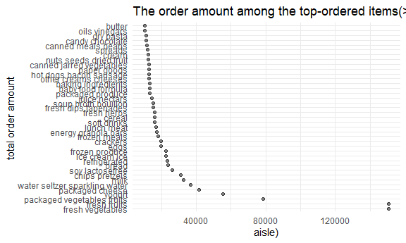
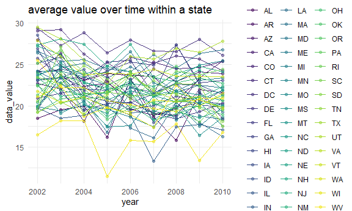
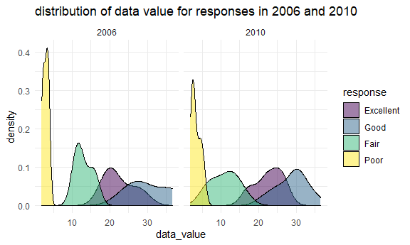

homework3
================
Sze Pui Tsang
10/20/2021

``` r
library(tidyverse)
```

    ## -- Attaching packages --------------------------------------- tidyverse 1.3.1 --

    ## v ggplot2 3.3.5     v purrr   0.3.4
    ## v tibble  3.1.4     v dplyr   1.0.7
    ## v tidyr   1.1.4     v stringr 1.4.0
    ## v readr   2.0.2     v forcats 0.5.1

    ## -- Conflicts ------------------------------------------ tidyverse_conflicts() --
    ## x dplyr::filter() masks stats::filter()
    ## x dplyr::lag()    masks stats::lag()

``` r
library(dplyr)
library(ggplot2)
library(p8105.datasets)

knitr::opts_chunk$set(
  fig.width = 6,
  fig.asp = .6,
  out.width = "90%"
)

theme_set(theme_minimal() + theme(legend.position = "bottom"))

options(
  ggplot2.continuous.colour = "viridis",
  ggplot2.continuous.fill = "viridis"
)

scale_colour_discrete = scale_colour_viridis_d
scale_fill_discrete = scale_fill_viridis_d
```

\#Problem 1

``` r
data("instacart")
```

There are a total of 134 aisles. The item with the most order was fresh
vegetables, with the order sum 150609 times.

``` r
aisle_ordered = instacart %>%
  count(aisle) %>%
  rename(order_sum = n) %>%
  arrange(desc(order_sum))
```

note :reoder the point theme(axis.text.x = element\_text(angle = 90))

``` r
aisle_ordered%>%
 filter(order_sum >= 10000)%>%
  ggplot(aes(x= order_sum, y=reorder(aisle, -order_sum)))+ 
  geom_point(alpha = .5 )+ 
  labs(
    title = "The order amount among the top-ordered items(>= 10000 orders)",
     x = "aisle)",
    y = "total order amount ")+
  coord_cartesian(expand =TRUE)
```



If you want to select more than one subject you can use the %in%
operator.

``` r
instacart %>%
  group_by(aisle)%>%
  filter(aisle %in% c("baking ingredients","dog food care","packaged vegetables fruits"))%>%
  count(product_name)%>%
  rename(order_sum = n)%>%
  arrange(aisle, desc(order_sum))%>%
  filter(row_number()<=3)%>%
  knitr::kable()
```

| aisle                      | product\_name                                 | order\_sum |
|:---------------------------|:----------------------------------------------|-----------:|
| baking ingredients         | Light Brown Sugar                             |        499 |
| baking ingredients         | Pure Baking Soda                              |        387 |
| baking ingredients         | Cane Sugar                                    |        336 |
| dog food care              | Snack Sticks Chicken & Rice Recipe Dog Treats |         30 |
| dog food care              | Organix Chicken & Brown Rice Recipe           |         28 |
| dog food care              | Small Dog Biscuits                            |         26 |
| packaged vegetables fruits | Organic Baby Spinach                          |       9784 |
| packaged vegetables fruits | Organic Raspberries                           |       5546 |
| packaged vegetables fruits | Organic Blueberries                           |       4966 |

combind the mutate with case\_when or if\_else

``` r
instacart %>%
   filter(product_name %in% c("Pink Lady Apples","Coffee Ice Cream"))%>%
  group_by(product_name, order_dow)%>%
  summarize(mean_hour = mean(order_hour_of_day))%>%
  mutate(order_dow =
           case_when(order_dow ==0 ~ "Sunday",
                    order_dow ==1 ~ "Monday",
                    order_dow ==2~ "Tuesday",
                    order_dow ==3~ "Wednesday",
                    order_dow ==4~ "Thursday",
                    order_dow ==5~ "Friday",
                    order_dow ==6~ "Saturday"))%>%
  pivot_wider(names_from = order_dow, 
              values_from = mean_hour)%>%
  relocate("Sunday", .after ="Saturday" )%>%
  knitr::kable()
```

    ## `summarise()` has grouped output by 'product_name'. You can override using the `.groups` argument.

| product\_name    |   Monday |  Tuesday | Wednesday | Thursday |   Friday | Saturday |   Sunday |
|:-----------------|---------:|---------:|----------:|---------:|---------:|---------:|---------:|
| Coffee Ice Cream | 14.31579 | 15.38095 |  15.31818 | 15.21739 | 12.26316 | 13.83333 | 13.77419 |
| Pink Lady Apples | 11.36000 | 11.70213 |  14.25000 | 11.55172 | 12.78431 | 11.93750 | 13.44118 |

\#Problem2

``` r
data("brfss_smart2010")
```

& and && indicate logical AND and \| and \|\| indicate logical OR.

``` r
clean_brfss_smart = brfss_smart2010 %>%
  janitor::clean_names() %>%
  rename(state = locationabbr, state_country = locationdesc)%>%
  filter(topic == "Overall Health",
         response == "Excellent"|
         response == "Good"|
         response == "Fair"|
         response == "Poor")%>%
  mutate(response = as_factor(response))
```

In 2002, there are 6 states with more than 7 times of observation, they
are CT,FL,MA,NC,NJ,PA respectively. In 2010, there are a total of 14
states with more than 7 times observation.

``` r
observed_location_02 =clean_brfss_smart%>%
  filter(year == 2002)%>%
  distinct(state,state_country)%>%
  group_by(state)%>%
  count()%>%
  filter(n >= 7)%>%
  rename( obs_time =n)%>%
  arrange(obs_time)

observed_location_10 = clean_brfss_smart%>%
  filter(year == 2010)%>%
  distinct(state,state_country)%>%
  group_by(state)%>%
  count()%>%
  filter(n >= 7)%>%
  rename( obs_time =n)%>%
  arrange(obs_time)
```

``` r
Excellent_resp = clean_brfss_smart%>%
  filter(response == "Excellent")%>%
  select (state, year, data_value)%>%
  group_by(state, year)%>%
  summarise_at(vars(data_value),list(data_value = mean))
  
ggplot(Excellent_resp,aes(x = year, y = data_value, color = state)) + 
  geom_point(alpha = .5) +
  geom_line()+ 
  labs(
    title = "average value over time within a state ",
     x = "year",
    y = " data_value ")+
  coord_cartesian(expand =TRUE)+
  theme(legend.position ="right")
```

    ## Warning: Removed 4 rows containing missing values (geom_point).

    ## Warning: Removed 3 row(s) containing missing values (geom_path).



``` r
two_panel_plot = clean_brfss_smart%>%
  filter(year %in% c(2006,2010) & state == "NY")%>%
  group_by(year, response)

ggplot(two_panel_plot,aes(x= data_value, fill =response))+
  geom_density(alpha = .5)+
   facet_grid(~year) +  
  labs( title = "distribution of data value for responses in 2006 and 2010 ")+
  viridis::scale_fill_viridis(discrete = TRUE)+
  theme(legend.position ="right")
```


